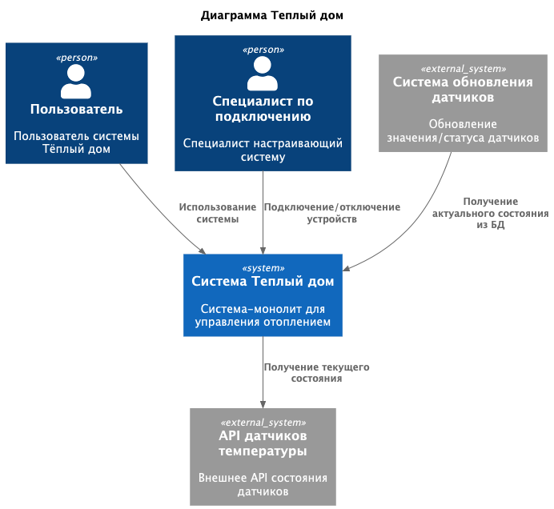
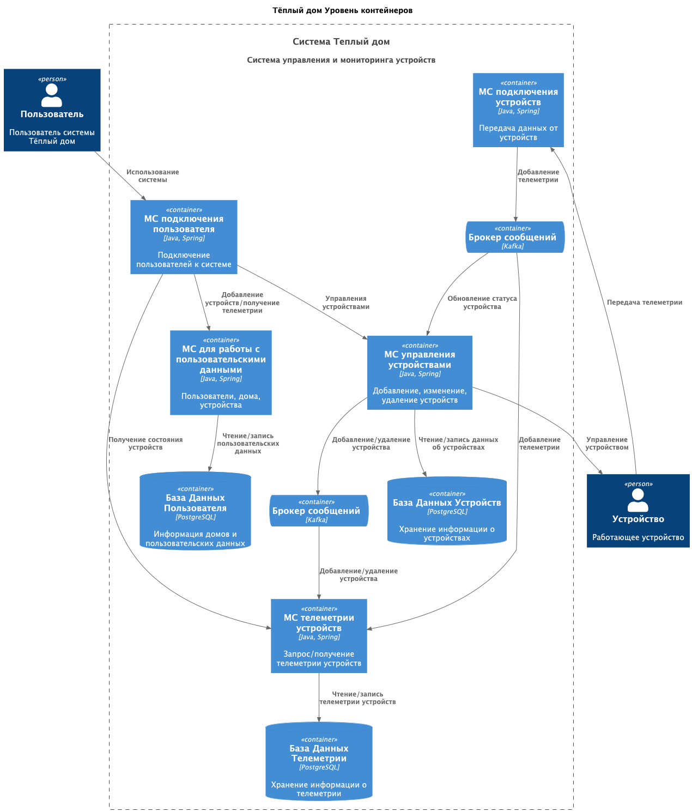
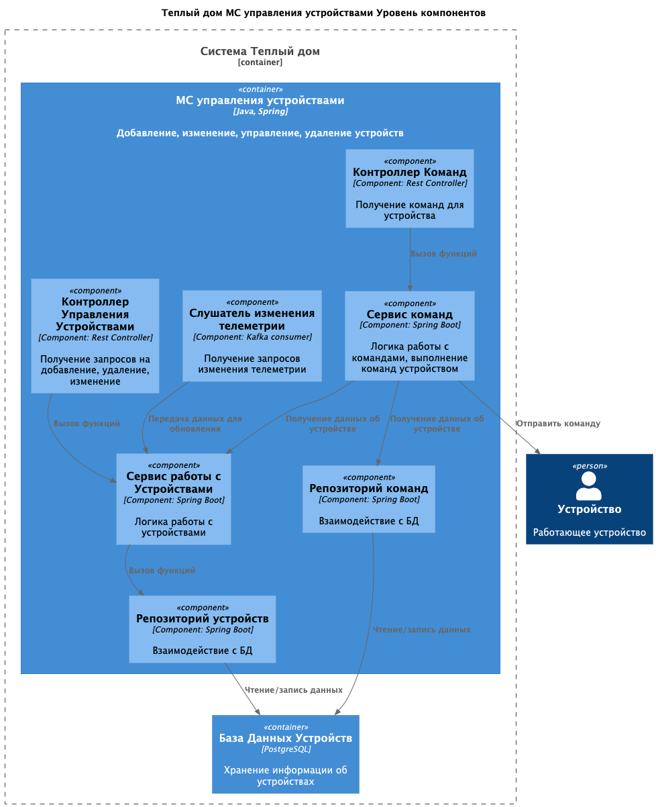
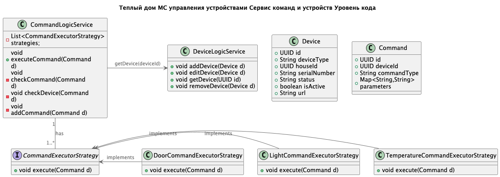
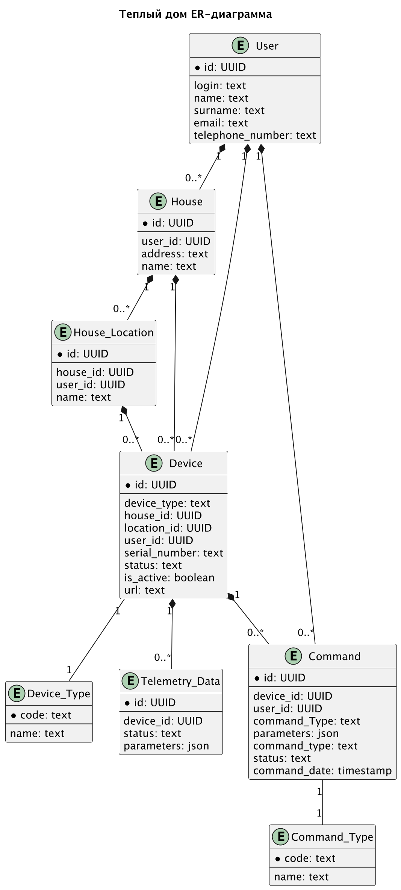

# Project_template

«Тёплый дом» — это небольшая компания, которая организует удалённое управление отоплением в доме. Недавно она выиграла тендер и получила заказ на создание экосистемы умных посёлков на территории нескольких регионов страны. 

# Задание 1. Анализ и планирование

<aside>

Чтобы составить документ с описанием текущей архитектуры приложения, можно часть информации взять из описания компании и условия задания. Это нормально.

</aside>

### 1. Описание функциональности монолитного приложения

**Управление отоплением:**

- Пользователи могут удалённо включать/выключать отопление в своих домах.
- Система поддерживает удаленный просмотр и обновление датчиков: 
  - обновление только статуса и значения датчика, 
  - обновление любых параметров датчика
  - удаление датчика - для роли специалиста
  - создание датчика - для роли специалиста
- Значения датчиков обновляются только в БД. Считаем, что датчики получают актуальное значение из БД и применяют его.
- Предполагаем, что добавление и удаление датчиков доступно только при выезде специалиста.

**Мониторинг температуры:**

- Пользователи могут просматривать текущую температуру в своих домах через веб-интерфейс.
- Система поддерживает получение данных о температуре с датчиков, установленных в домах:
  - получение состояния всех датчиков
  - получение состояния датчика по ИД 
  - получение состояния датчика по месторасположению

### 2. Анализ архитектуры монолитного приложения

Перечислите здесь основные особенности текущего приложения: какой язык программирования используется, какая база данных, как организовано взаимодействие между компонентами и так далее.
- Язык программирования: Go 
- База данных: PostgreSQL 
- Архитектура: Монолитная, все компоненты системы (обработка запросов, бизнес-логика, работа с данными) находятся в рамках одного приложения. 
- Взаимодействие: Синхронное, запросы обрабатываются последовательно. 

### 3. Определение доменов и границы контекстов

Домены:
- Теплый дом:

Поддомены:
  - Управление отоплением
    - контекст: включение/выключение датчика
    - контекст: изменение параметров датчика
  - Мониторинг температуры
    - контекст: получение данных датчика

### **4. Проблемы монолитного решения**

- Масштабируемость: Ограничена, так как монолит сложно масштабировать по частям.
- Развертывание: Требует остановки всего приложения.
- Эксплуатация: все взаимодействия последовательны и синхронны, сбой на любом этапе может привести к отказу всей системы

### 5. Визуализация контекста системы — диаграмма С4


```markdown
[Диаграмма контекста](schemas/context/WarmHouse_Monolit_Context.puml)
```

# Задание 2. Проектирование микросервисной архитектуры

В этом задании вам нужно предоставить только диаграммы в модели C4. Мы не просим вас отдельно описывать получившиеся микросервисы и то, как вы определили взаимодействия между компонентами To-Be системы. Если вы правильно подготовите диаграммы C4, они и так это покажут.

**Диаграмма контейнеров (Containers)**

```markdown
[Диаграмма контейнеров](schemas/container/WarmHouse_Container.puml)
```

**Диаграмма компонентов (Components)**

```markdown
[Диаграмма компонентов](schemas/component/WarmHouse_Component_DeviceService.puml)
```

**Диаграмма кода (Code)**

```markdown
[Диаграмма кода](schemas/code/WarmHouse_Code_DeviceService.puml)
```

# Задание 3. Разработка ER-диаграммы

Добавьте сюда ER-диаграмму. Она должна отражать ключевые сущности системы, их атрибуты и тип связей между ними.



# Задание 4. Создание и документирование API

### 1. Тип API

АПИ устройств.

Тип АПИ: синхронное REST API.

- При добавлении, обновлении или удалении устройства, клиент должен сразу получать ответ об успехе операции или о деталях ошибки.
- Для получения списка устройств также требуется синхронное взаимодействие, в ответе которого клиент получит список устройств.

АПИ команд.

Тип АПИ: синхронное REST API.
- При добавлении команды, клиент должен сразу получать ответ об успехе операции или о деталях ошибки.
- Для получения списка команд необходимо синхронно взаимодействие.

АПИ получения телеметрии.

Тип АПИ: синхронное REST API.
- Для получения состояния и параметров устройства необходимо синхронно взаимодействие.

АПИ добавления телеметрии.

Тип АПИ: асинхронное AsyncAPI.
- Для добавления данных телеметрии с устройств нет необходимости в получении ответа устройством от сервера
Также асинхронное взаимодействие позволит снизить связность компонента МС телеметрии, 
а его недоступность не скажется на работоспособности всей системы.

### 2. Документация API

```markdown
[АПИ устройств и команд](schemas/api/device-api.yaml)
```

```markdown
[АПИ получения телеметрии](schemas/api/telemetry-api.yaml)
```

```markdown
[АПИ добавления телеметрии](schemas/api/TelemetryData.json)
```

# Задание 5. Работа с docker и docker-compose

Перейдите в apps.

Там находится приложение-монолит для работы с датчиками температуры. В README.md описано как запустить решение.

Сделано:

1) Приложение temperature-api - apps/temperature-api

2) Упаковано docker-compose. Использовать docker-compose расположенный в config/docker-compose.yml (тут же упакованы МС)

3) Добавлена БД в docker-compose файл с указанием скрипта инициализации ./smart_home/init.sql

Для проверки использовалась коллекция smarthome-api.postman_collection.json:

- Create Sensor
- Get All Sensors

Должно при каждом вызове отображаться разное значение температуры

Ревьюер будет проверять точно так же.


# **Задание 6. Разработка MVP**

Необходимо создать новые микросервисы и обеспечить их интеграции с существующим монолитом для плавного перехода к микросервисной архитектуре.

### **Что нужно сделать**

1. Реализованы 2 МС:
   - Управление Устройствами - DeviceService 
     - Стек: Java SpringBoot
     - Отдельная БД Postgres
     - Реализовано REST api для взаимодействия с Устройствами 
     - Реализован консюмер для добавления Устройств асинхронно
   
   - Управление телеметрией - TelemetryService 
     - Стек: Kotlin SpringBoot
     - Отдельная БД Postgres
     - Реализовано REST api для взаимодействия с телеметрией 
     - Реализован консюмер для добавления телеметрии асинхронно

2. При вызове АПИ на монолите: POST http://localhost:8080/api/v1/sensors для добавления сенсора, 
также выполняется запрос в МС DeviceService для добавления устройства и в TelemetryService для добавления первичной телеметрии.

Для упрощения запросы из монолита выполнены синхронно. Но возможность чтения из кафки в МС подразумевается.

Файл docker-compose расположен - config/docker-compose.yml 
Докер файлы Мс расположены в соответствующих директориях с микросервисами.